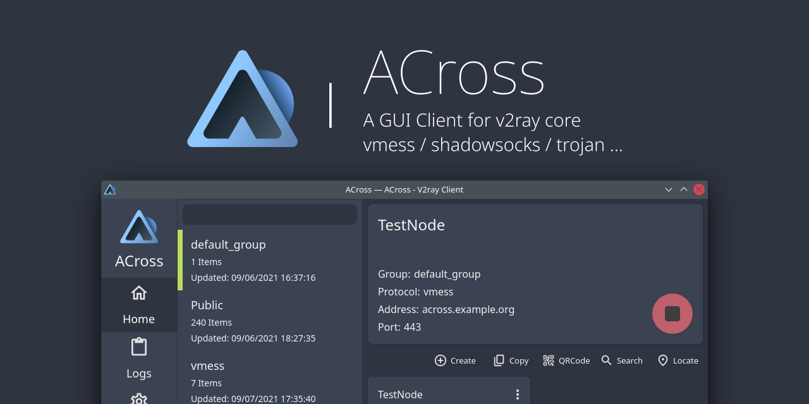

## Welcome
Welcome to ACross's official documentation. Here you can find probability anything you need to know about the configurations of your instance, the usage and the contributing guidelines. 

`ACross` is a simple and modern GUI client for v2ray written in Qt6 & QML which is one of the main products of the `Arktoria` community. We focus on user experience,  simple and practical, no much redundant functions but doing it well and flexibility. For instance, we do not provide a build-in core to keep the project pure and clean, but you can easily set the core and even customize the interface for your core branch. One of the crucial pieces of ACross is our community which is always asking us for new features or reporting issues that might happen. We rececommend you vividly to check our [Github Issues](https://github.com/ArkToria/ACross/issues). For developers, we welcome you refer to the contributing page.

## Supported Platforms
- Linux
- Windows (at least Windows 10 or newer)

## Protocols
- VMESS
- Trojan
- Shadowsocks

## Subscriptions
- SIP008
- Base64 (`ss://` | `vmess://` | `trojan://`)

We also provide manual local configuration management and regular automatic update. All nodes information will be stored in the `SQLite` database which you can easily backup and read the data without this app.